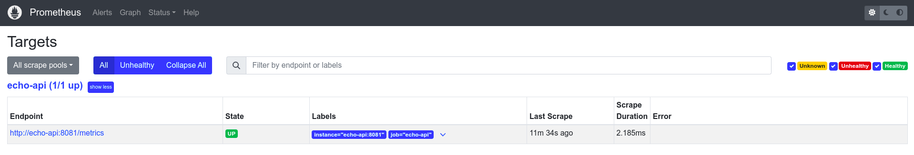
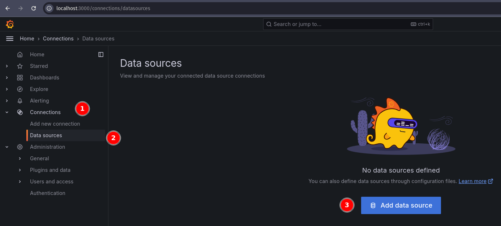
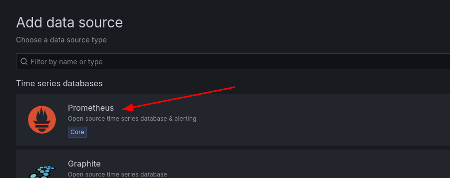
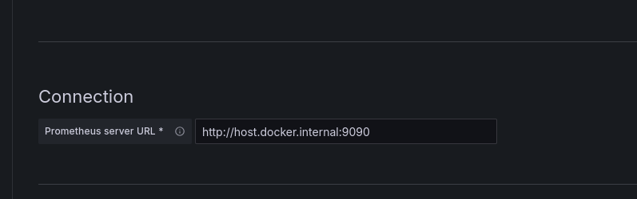
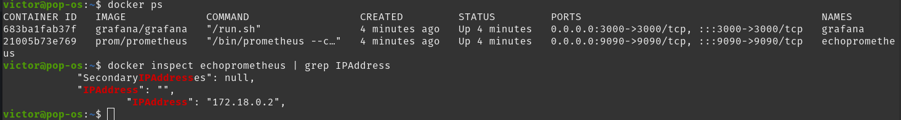
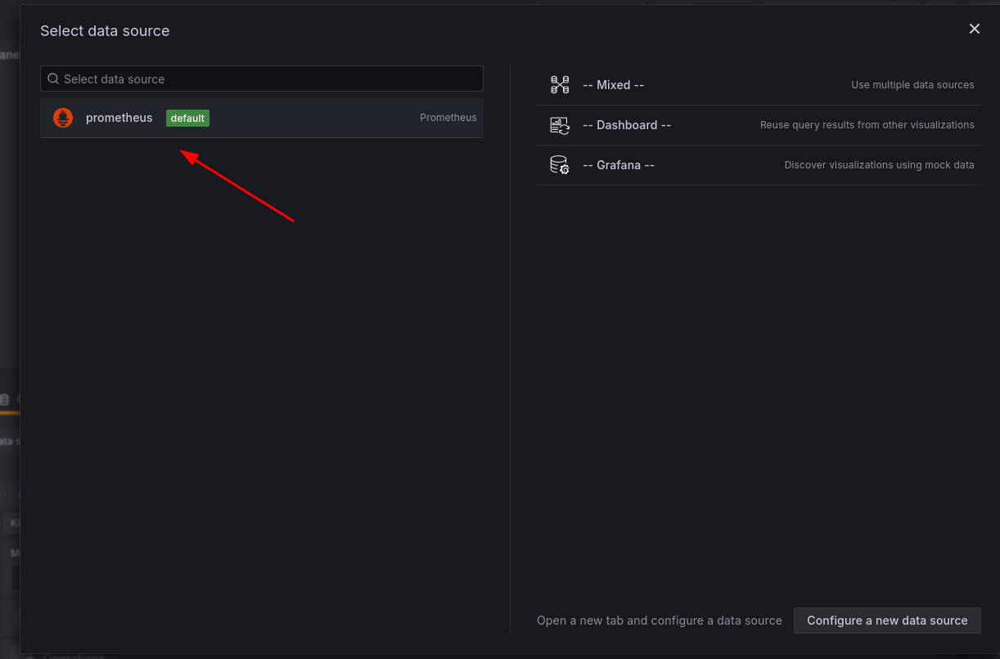
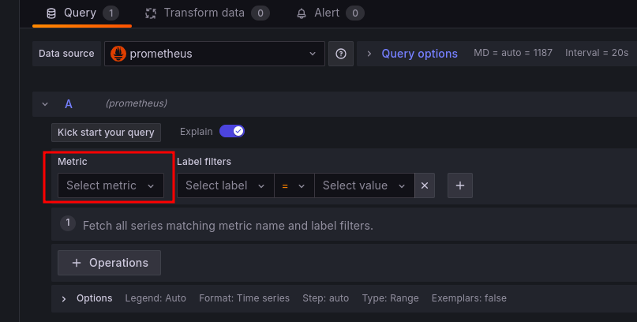

# How to use this

1. Simply run `make run-all`, this command will:

- Spin up prometheus container (port 9090)
- Spin up grafana container (port 3000)
- Spin up api container (port 8081)

**Attention:** you need to have the api running on a separate container, otherwise prometheus won't be able to get its data. 

* You can check if prometheus is targetting the API correctly on the following url:

```bash
http://localhost:9090/targets
```

Should display the following:



## Call the /metrics endpoint

* Without logging as admin:

```bash
curl http://localhost:8081/metrics -v
```
example response:

```text
*   Trying 127.0.0.1:8081...
* Connected to localhost (127.0.0.1) port 8081 (#0)
> GET /metrics HTTP/1.1
> Host: localhost:8081
> User-Agent: curl/7.81.0
> Accept: */*
> 
* Mark bundle as not supporting multiuse
< HTTP/1.1 401 Unauthorized
< Content-Type: application/json
< Www-Authenticate: basic realm=Restricted
< Date: Wed, 18 Sep 2024 22:48:41 GMT
< Content-Length: 27
< 
{"message":"Unauthorized"}
* Connection #0 to host localhost left intact
```

* Logging as admin and doing the requests will show all the logs:

```bash
curl -u admin:admin http://localhost:8081/metrics -v
```

```text
*   Trying 127.0.0.1:8081...
* Connected to localhost (127.0.0.1) port 8081 (#0)
* Server auth using Basic with user 'admin'
> GET /metrics HTTP/1.1
> Host: localhost:8081
> Authorization: Basic YWRtaW46YWRtaW4=
> User-Agent: curl/7.81.0
> Accept: */*
> 
* Mark bundle as not supporting multiuse
< HTTP/1.1 200 OK
< Content-Type: text/plain; version=0.0.4; charset=utf-8; escaping=values
< Date: Wed, 18 Sep 2024 22:51:01 GMT
< Transfer-Encoding: chunked
< 
# HELP go_gc_duration_seconds A summary of the pause duration of garbage collection cycles.
# TYPE go_gc_duration_seconds summary
go_gc_duration_seconds{quantile="0"} 0
go_gc_duration_seconds{quantile="0.25"} 0
go_gc_duration_seconds{quantile="0.5"} 0
go_gc_duration_seconds{quantile="0.75"} 0
go_gc_duration_seconds{quantile="1"} 0
go_gc_duration_seconds_sum 0
go_gc_duration_seconds_count 0
# HELP go_goroutines Number of goroutines that currently exist.
# TYPE go_goroutines gauge
go_goroutines 7
# HELP go_info Information about the Go environment.
# TYPE go_info gauge
go_info{version="go1.23.1"} 1
# HELP go_memstats_alloc_bytes Number of bytes allocated and still in use.
# TYPE go_memstats_alloc_bytes gauge
go_memstats_alloc_bytes 178240
# HELP go_memstats_alloc_bytes_total Total number of bytes allocated, even if freed.
# TYPE go_memstats_alloc_bytes_total counter
go_memstats_alloc_bytes_total 178240
# HELP go_memstats_buck_hash_sys_bytes Number of bytes used by the profiling bucket hash table.
# TYPE go_memstats_buck_hash_sys_bytes gauge
go_memstats_buck_hash_sys_bytes 3747
# HELP go_memstats_frees_total Total number of frees.
# TYPE go_memstats_frees_total counter
go_memstats_frees_total 0
# HELP go_memstats_gc_sys_bytes Number of bytes used for garbage collection system metadata.
# TYPE go_memstats_gc_sys_bytes gauge
go_memstats_gc_sys_bytes 1.416688e+06
# HELP go_memstats_heap_alloc_bytes Number of heap bytes allocated and still in use.
# TYPE go_memstats_heap_alloc_bytes gauge
go_memstats_heap_alloc_bytes 178240
# HELP go_memstats_heap_idle_bytes Number of heap bytes waiting to be used.
# TYPE go_memstats_heap_idle_bytes gauge
go_memstats_heap_idle_bytes 1.957888e+06
# HELP go_memstats_heap_inuse_bytes Number of heap bytes that are in use.
# TYPE go_memstats_heap_inuse_bytes gauge
go_memstats_heap_inuse_bytes 1.777664e+06
# HELP go_memstats_heap_objects Number of allocated objects.
# TYPE go_memstats_heap_objects gauge
go_memstats_heap_objects 578
# HELP go_memstats_heap_released_bytes Number of heap bytes released to OS.
# TYPE go_memstats_heap_released_bytes gauge
go_memstats_heap_released_bytes 1.957888e+06
# HELP go_memstats_heap_sys_bytes Number of heap bytes obtained from system.
# TYPE go_memstats_heap_sys_bytes gauge
go_memstats_heap_sys_bytes 3.735552e+06
# HELP go_memstats_last_gc_time_seconds Number of seconds since 1970 of last garbage collection.
# TYPE go_memstats_last_gc_time_seconds gauge
go_memstats_last_gc_time_seconds 0
# HELP go_memstats_lookups_total Total number of pointer lookups.
# TYPE go_memstats_lookups_total counter
go_memstats_lookups_total 0
# HELP go_memstats_mallocs_total Total number of mallocs.
# TYPE go_memstats_mallocs_total counter
go_memstats_mallocs_total 578
# HELP go_memstats_mcache_inuse_bytes Number of bytes in use by mcache structures.
# TYPE go_memstats_mcache_inuse_bytes gauge
go_memstats_mcache_inuse_bytes 4800
# HELP go_memstats_mcache_sys_bytes Number of bytes used for mcache structures obtained from system.
# TYPE go_memstats_mcache_sys_bytes gauge
go_memstats_mcache_sys_bytes 15600
# HELP go_memstats_mspan_inuse_bytes Number of bytes in use by mspan structures.
# TYPE go_memstats_mspan_inuse_bytes gauge
go_memstats_mspan_inuse_bytes 34720
# HELP go_memstats_mspan_sys_bytes Number of bytes used for mspan structures obtained from system.
# TYPE go_memstats_mspan_sys_bytes gauge
go_memstats_mspan_sys_bytes 48960
# HELP go_memstats_next_gc_bytes Number of heap bytes when next garbage collection will take place.
# TYPE go_memstats_next_gc_bytes gauge
go_memstats_next_gc_bytes 4.194304e+06
# HELP go_memstats_other_sys_bytes Number of bytes used for other system allocations.
# TYPE go_memstats_other_sys_bytes gauge
go_memstats_other_sys_bytes 963405
# HELP go_memstats_stack_inuse_bytes Number of bytes in use by the stack allocator.
# TYPE go_memstats_stack_inuse_bytes gauge
go_memstats_stack_inuse_bytes 458752
# HELP go_memstats_stack_sys_bytes Number of bytes obtained from system for stack allocator.
# TYPE go_memstats_stack_sys_bytes gauge
go_memstats_stack_sys_bytes 458752
# HELP go_memstats_sys_bytes Number of bytes obtained from system.
# TYPE go_memstats_sys_bytes gauge
go_memstats_sys_bytes 6.642704e+06
# HELP go_threads Number of OS threads created.
# TYPE go_threads gauge
go_threads 7
# HELP process_cpu_seconds_total Total user and system CPU time spent in seconds.
# TYPE process_cpu_seconds_total counter
process_cpu_seconds_total 0.01
# HELP process_max_fds Maximum number of open file descriptors.
# TYPE process_max_fds gauge
process_max_fds 1.048576e+06
# HELP process_open_fds Number of open file descriptors.
# TYPE process_open_fds gauge
process_open_fds 10
# HELP process_resident_memory_bytes Resident memory size in bytes.
# TYPE process_resident_memory_bytes gauge
process_resident_memory_bytes 1.0092544e+07
# HELP process_start_time_seconds Start time of the process since unix epoch in seconds.
# TYPE process_start_time_seconds gauge
process_start_time_seconds 1.72669970701e+09
# HELP process_virtual_memory_bytes Virtual memory size in bytes.
# TYPE process_virtual_memory_bytes gauge
process_virtual_memory_bytes 1.642491904e+09
# HELP process_virtual_memory_max_bytes Maximum amount of virtual memory available in bytes.
# TYPE process_virtual_memory_max_bytes gauge
process_virtual_memory_max_bytes 1.8446744073709552e+19
# HELP promhttp_metric_handler_requests_in_flight Current number of scrapes being served.
# TYPE promhttp_metric_handler_requests_in_flight gauge
promhttp_metric_handler_requests_in_flight 1
# HELP promhttp_metric_handler_requests_total Total number of scrapes by HTTP status code.
# TYPE promhttp_metric_handler_requests_total counter
promhttp_metric_handler_requests_total{code="200"} 0
promhttp_metric_handler_requests_total{code="500"} 0
promhttp_metric_handler_requests_total{code="503"} 0
* Connection #0 to host localhost left intact
```

## Spin up prometheus docker 

If you havent run `make run-all` before, you can run `make prom-run` and it will spin up the prometheus docker container for you.

- Under http://localhost:9090 you will be able to see prometheus dashboard

## Spin up grafana

If you havent run `make run-all` before, you can run `make grafana-run` and it will spin up a grafana container on http://localhost:3000

Under http://localhost:3000 you will be displayed a login card, fill it with "admin" and "admin" both for username and password. It will ask you to recreate your pass, do it and go straight to the dashboard.

1. On grafana UI, click **Connections** in the left-hand sidebar and select **Data sources** and **Add data source**



2. Select Prometheus as data source



3. Fill prometheus url, if you are doing the same config we have here, just fill with `http://192.168.100.1:9090` or localhost...



*If the above didn't work* do the following:

- Get the IPAddress from your prometheus container:

`docker inspect <container_name> | grep IPAddress`



Now get the **IPAddress** and fill the input with `http://<container_ip_address:<port>` or in our case http://172.18.0.2:9090

Click **Save & test**

4. Let's make the dashboard

Now, go to **Dashboards** > **Create dashboard** > **Add visualization**

Select **Prometheus** as data source.



- Under "Metric" we can choose which metric we want to select. We will be able to gather a bunch of default metrics, and custom ones from this dropdown:



Let's track the sum of data the response size in our requests. If you "Run queries", it will display a graph for us:


This would be de default graph:


However, we can change this layout, on the right top corner:


Let's select a bar chart option to see.


Let's apply the changes.


Now we have a new chart in our dashboard:


